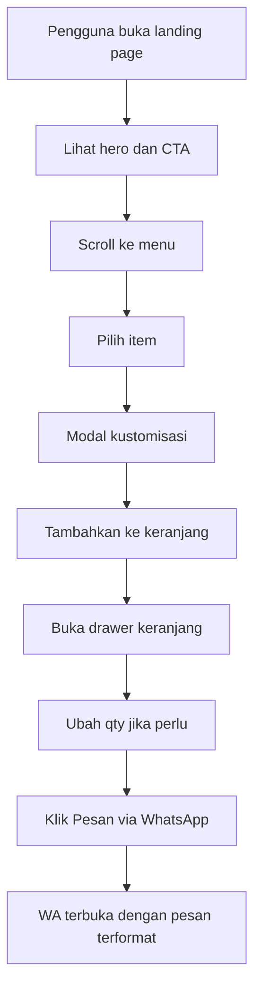

# Product Requirements Document (PRD) - Geprek Nabilla Web Ordering

> **Nama Produk:** Geprek Nabilla  
> **Status:** Active / Living Document  
> **Platform:** Web (mobile-first, responsive)  
> **Arsitektur:** Hybrid ringan (frontend statis + integrasi layanan eksternal WhatsApp)  
> **Target Release:** MVP v1.1 (Juni 2026)

---

## Riwayat Versi Dokumen (Document Version History)

| Versi | Tanggal | Penulis | Deskripsi Perubahan |
| :--- | :--- | :--- | :--- |
| **v1.0** | 2026-06-03 | Copilot + Tim Geprek | Inisiasi PRD berdasarkan implementasi aktual proyek Geprek Nabilla. |

---

## 1. Product Overview & Filosofi

Geprek Nabilla adalah landing page pemesanan makanan yang berfokus pada konversi cepat ke WhatsApp. Produk ini dibuat untuk mengurangi friction pemesanan warung: pengguna bisa lihat menu, kustomisasi pesanan, hitung total otomatis, lalu checkout lewat chat WA dalam alur yang sederhana.

Filosofi produk:
- Cepat: tanpa login, tanpa registrasi, langsung pilih dan pesan.
- Jelas: harga transparan, opsi kustomisasi terlihat sebelum checkout.
- Lokal: menonjolkan identitas warung di Gunungpati, Semarang.

---

## 2. Goals & Objectives

1. **Meningkatkan konversi order online ke WhatsApp**: Mempermudah pengguna berpindah dari melihat menu ke mengirim pesanan siap proses.
2. **Menyederhanakan proses pemesanan**: Pengguna dapat menambah item, mengatur opsi, dan melihat total tanpa perlu hitung manual.
3. **Menjaga performa web yang ringan**: Halaman cepat dimuat di perangkat mobile kelas menengah dengan interaksi yang tetap mulus.

---

## 3. Target Users (User Personas)

### 3.1. Raka (19) - Mahasiswa
* **Profil:** Tinggal di area kampus Gunungpati, sering beli makan lewat ponsel, sensitif terhadap harga.
* **Kebutuhan/Pain Points:** Ingin pesan cepat tanpa banyak langkah, perlu info harga jelas.
* **Peran Aplikasi:** Menyediakan katalog ringkas dan checkout WA sekali klik.

### 3.2. Dita (27) - Karyawan Sekitar
* **Profil:** Waktu istirahat terbatas, memesan untuk diri sendiri atau tim kecil.
* **Kebutuhan/Pain Points:** Sulit merangkum pesanan kolektif dan custom request.
* **Peran Aplikasi:** Keranjang dan kustomisasi membantu menyusun pesanan kolektif lebih rapi.

### 3.3. Pemilik Warung (Admin Operasional)
* **Profil:** Mengelola pesanan manual via WhatsApp.
* **Kebutuhan/Pain Points:** Pesanan chat sering tidak terstruktur (tanpa jumlah/rincian).
* **Peran Aplikasi:** Membentuk format pesan WA yang konsisten, lengkap, dan siap diproses.

---

## 4. User Stories

1. **Eksplorasi Menu**:
   * *Sebagai* calon pembeli,
   * *Saya ingin* melihat daftar makanan dan minuman beserta harga,
   * *Sehingga* saya bisa memutuskan pesanan tanpa bertanya manual di chat.
2. **Kustomisasi Pesanan**:
   * *Sebagai* pembeli,
   * *Saya ingin* memilih level pedas, opsi nasi, tingkat manis, dan jumlah,
   * *Sehingga* pesanan sesuai preferensi pribadi.
3. **Keranjang Dinamis**:
   * *Sebagai* pembeli,
   * *Saya ingin* menambah/mengurangi item di keranjang,
   * *Sehingga* total harga selalu akurat sebelum checkout.
4. **Checkout WhatsApp**:
   * *Sebagai* pembeli,
   * *Saya ingin* mengirim ringkasan pesanan otomatis ke WhatsApp,
   * *Sehingga* pemesanan lebih cepat dan minim typo.

---

## 5. Core Features (Peta Fitur & Kriteria Penerimaan)

### P0 - Must Have (Fitur Wajib untuk MVP)

#### 1. Katalog Menu Interaktif
* **Deskripsi:** Menampilkan menu makanan/minuman dengan gambar, deskripsi singkat, dan harga; tombol tambah keranjang tersedia di setiap kartu produk.
* **Kriteria Penerimaan:**
  * **Given:** Pengguna membuka halaman utama.
  * **When:** Pengguna scroll ke bagian menu.
  * **Then:** Pengguna melihat daftar item, harga, dan tombol tambah keranjang yang aktif.

#### 2. Modal Kustomisasi Pesanan
* **Deskripsi:** Sebelum item masuk keranjang, pengguna memilih opsi sesuai kategori (makanan: level pedas + opsi nasi; minuman: tingkat manis) dan jumlah item.
* **Kriteria Penerimaan:**
  * **Given:** Pengguna menekan tombol tambah keranjang pada item.
  * **When:** Modal kustomisasi muncul dan pengguna memilih opsi lalu konfirmasi.
  * **Then:** Item masuk keranjang dengan kombinasi opsi, harga akhir, dan kuantitas yang tepat.

#### 3. Keranjang Belanja Floating + Drawer
* **Deskripsi:** Menampilkan badge jumlah item, daftar item di keranjang, kontrol plus/minus, subtotal item, dan total akhir.
* **Kriteria Penerimaan:**
  * **Given:** Keranjang berisi minimal satu item.
  * **When:** Pengguna membuka keranjang dan mengubah kuantitas.
  * **Then:** Total item dan total harga terbarui real-time.

#### 4. Checkout ke WhatsApp
* **Deskripsi:** Sistem membentuk pesan terstruktur berisi daftar item, opsi kustomisasi, subtotal, dan total akhir lalu membuka link wa.me.
* **Kriteria Penerimaan:**
  * **Given:** Keranjang tidak kosong.
  * **When:** Pengguna menekan tombol Pesan via WhatsApp.
  * **Then:** Browser membuka tab baru ke WhatsApp dengan pesan pesanan yang telah terisi.

#### 5. Informasi Lokasi dan Kontak
* **Deskripsi:** Menampilkan alamat warung, kontak WhatsApp, dan embed Google Maps untuk memudahkan kunjungan offline.
* **Kriteria Penerimaan:**
  * **Given:** Pengguna membuka bagian lokasi.
  * **When:** Pengguna melihat section warung.
  * **Then:** Informasi alamat dan peta tampil dengan baik di desktop maupun mobile.

---

### P1 - Should Have (Penting tapi Bisa Ditunda Pasca-MVP)

#### 6. Persistensi Keranjang Lokal
* **Deskripsi:** Menyimpan state keranjang ke localStorage agar tidak hilang saat refresh.
* **Kriteria Penerimaan:**
  * **Given:** Pengguna sudah menambah item ke keranjang.
  * **When:** Pengguna refresh halaman.
  * **Then:** Isi keranjang dipulihkan otomatis.

#### 7. Konfigurasi Data via JSON Terpisah
* **Deskripsi:** Memindahkan data menu/harga/WA number dari hardcode HTML/JS ke file konfigurasi agar mudah dikelola non-developer.

#### 8. Event Tracking Dasar
* **Deskripsi:** Menambahkan event view_menu, add_to_cart, open_checkout, send_whatsapp untuk evaluasi funnel.

---

### P2 - Nice to Have (Fitur Tambahan / Rencana Masa Depan)

#### 9. Estimasi Ongkir Otomatis
* **Deskripsi:** Kalkulasi ongkir berdasarkan titik pengguna.

#### 10. Opsi Pickup vs Delivery
* **Deskripsi:** Pengguna bisa memilih metode pengambilan untuk menyesuaikan alur pesanan.

#### 11. Integrasi Pembayaran Digital
* **Deskripsi:** Menyediakan opsi DP/full payment sebelum pesanan diproses.

---

## 6. Technical Requirements & Stack

* **Framework/Platform:** Frontend web statis dengan Vite sebagai dev/build tool.
* **State Management:** Vanilla JavaScript (in-memory object untuk cart state).
* **Persistence Layer (Database):** Belum ada database pada MVP (state hilang saat reload).
* **API / Integrasi Pihak Ketiga:** wa.me deep link (checkout), Google Maps Embed (lokasi).
* **Hosting Target:** Static hosting (Vercel/Netlify/GitHub Pages atau server statis setara).
* **Kriteria Performa Teknis:**
  * First Contentful Paint target < 1.8 detik pada koneksi 4G.
  * Largest Contentful Paint target < 2.5 detik.
  * Interaksi tombol utama responsif < 100 ms untuk feedback visual.

---

## 7. Data Model & Database Schema

MVP belum menggunakan database server. Model data utama berada di runtime JavaScript.

### 7.1. Model CartItem (runtime)

```json
{
  "id": "geprek-Lvl0-PakeNasi",
  "name": "Ayam Geprek",
  "price": 13000,
  "qty": 2,
  "options": ["Lvl 0", "Pake Nasi"]
}
```

### 7.2. Rencana Skema (fase pasca-MVP, opsional)

```sql
CREATE TABLE orders (
    id INTEGER PRIMARY KEY AUTOINCREMENT,
    order_code TEXT NOT NULL,
    channel TEXT NOT NULL DEFAULT 'whatsapp',
    total_amount INTEGER NOT NULL,
    created_at DATETIME NOT NULL
);

CREATE TABLE order_items (
    id INTEGER PRIMARY KEY AUTOINCREMENT,
    order_id INTEGER NOT NULL,
    item_name TEXT NOT NULL,
    unit_price INTEGER NOT NULL,
    qty INTEGER NOT NULL,
    options_json TEXT,
    FOREIGN KEY (order_id) REFERENCES orders(id)
);
```

---

## 8. UI/UX Design System Specification

### 8.1. Palette & Tema Warna
* **Light Theme (aktif):** Dominan krem terang untuk background dengan aksen merah cabai sebagai primary.
* **Dark Theme:** Belum diimplementasikan pada MVP.
* **Efek & Karakteristik Visual:** Glassmorphism pada navbar, hover elevation pada kartu menu, reveal animation berbasis Intersection Observer.

### 8.2. Tipografi & Corner Radius
* **Font Family:** Plus Jakarta Sans (heading), Lexend (body).
* **Sudut Kelengkungan (Corner Radius):** Kartu ±1rem, elemen besar ±1.5rem, tombol CTA menggunakan pill radius.

### 8.3. Prinsip UX Utama
* CTA primer Pesan via WA harus terlihat di hero dan checkout keranjang.
* Informasi harga selalu tampil dekat tombol aksi.
* Alur mobile-first dengan target tap area minimal 48px.

---

## 9. Success Metrics (Target Kinerja & Adopsi)

### 9.1. Key Performance Indicators (KPIs)
* **Menu-to-Cart Rate:** >= 20% sesi menambahkan minimal 1 item.
* **Cart-to-WhatsApp Rate:** >= 60% sesi yang membuka keranjang menekan checkout WA.
* **Bounce Rate Landing:** <= 45% pada traffic organik/lokal.
* **Page Performance:** LCP < 2.5 detik pada mayoritas perangkat mobile target.

### 9.2. Objectives & Key Results (OKRs)
* **Objective 1: Meningkatkan pesanan harian dari kanal web**
  * *KR1:* +30% chat order WA yang berasal dari landing page dalam 8 minggu.
  * *KR2:* Minimal 100 sesi unik per minggu dengan CTR CTA utama >= 12%.

---

## 10. Risiko & Mitigasi Teknis

1. **Nomor WhatsApp masih placeholder**:
   * *Risiko:* Checkout mengarah ke nomor salah/tidak aktif.
   * *Mitigasi:* Simpan nomor WA di konfigurasi terpusat dan validasi sebelum deploy produksi.
2. **State keranjang belum persisten**:
   * *Risiko:* Pengguna kehilangan keranjang saat refresh/tab tertutup.
   * *Mitigasi:* Implementasi localStorage pada fase P1.
3. **Data menu masih hardcoded**:
   * *Risiko:* Update menu/harga berpotensi lupa sinkron di beberapa tempat.
   * *Mitigasi:* Refactor ke satu sumber data JSON dan render dinamis.
4. **Ketergantungan layanan eksternal (WA dan Maps)**:
   * *Risiko:* Jika layanan terblokir atau lambat, sebagian fitur terganggu.
   * *Mitigasi:* Sediakan fallback teks kontak/manual direction.

---

## 11. Alur Pengguna (User Flow)



### 11.1. Langkah-Langkah Alur Utama
1. **Eksplorasi:** Pengguna melihat menu dan harga dari section galeri kuliner.
2. **Konfigurasi:** Pengguna memilih opsi item (pedas/manis/nasi) dan jumlah.
3. **Validasi:** Pengguna meninjau keranjang dan total belanja.
4. **Checkout:** Pengguna mengirim pesanan melalui WhatsApp dari link otomatis.

---

## 12. Arsitektur Kode & Struktur Direktori

```plaintext
/
├── index.html              # Struktur konten landing page dan komponen modal
├── index.css               # Design tokens, layout, animasi, dan style komponen
├── app.js                  # State management cart, modal logic, checkout WA
├── assets/                 # Gambar menu, hero, favicon
├── docs/                   # Dokumen produk dan perencanaan
├── package.json            # Script dev/build/preview dengan Vite
└── .agent/                 # Toolkit agent dan workflow pendukung development
```

Pola arsitektur saat ini: monolithic frontend file-based, dengan pemisahan concern dasar di level file (markup/style/logic).

---

## 13. Catatan Keputusan Teknis (Architectural Decision Records)

### 13.1. ADR 01: Memilih Vanilla JS + Vite untuk MVP
* **Keputusan:** Menggunakan HTML/CSS/JS murni dengan Vite sebagai tooling.
* **Alasan:** Time-to-market cepat, setup ringan, cocok untuk kebutuhan landing page interaktif tanpa kompleksitas framework.

### 13.2. ADR 02: Checkout berbasis WhatsApp Deep Link
* **Keputusan:** Tidak membangun backend order pada MVP; checkout diarahkan ke WA dengan pesan terstruktur.
* **Alasan:** Menurunkan biaya implementasi awal, sesuai kebiasaan operasional warung yang sudah menerima order via chat.

### 13.3. ADR 03: Kustomisasi di sisi klien sebelum checkout
* **Keputusan:** Opsi item dipilih lewat modal klien lalu dirangkum ke keranjang.
* **Alasan:** Mengurangi percakapan bolak-balik di WA dan meningkatkan kualitas detail pesanan.

---

## 14. Persyaratan Non-Fungsional (Non-Functional Requirements)

### 14.1. Performa (Performance)
* **Kriteria:** Target LCP < 2.5 detik, layout stabil, dan animasi tetap halus pada perangkat mobile menengah.

### 14.2. Aksesibilitas (Accessibility)
* **Kriteria:** Tap target utama >= 48px, teks terbaca jelas, alt text tersedia pada gambar menu utama.

### 14.3. Keamanan & Privasi Data (Security & Privacy)
* **Kriteria:** Tidak menyimpan data pribadi pengguna di server pada MVP; hindari hardcode secret sensitif di frontend.

### 14.4. Reliability
* **Kriteria:** Jika JS gagal, konten utama dan informasi kontak tetap dapat dibaca (graceful degradation).

---

## 15. Strategi Pengujian & Penjaminan Mutu (Testing & QA Strategy)

### 15.1. Pengujian Unit (Unit Testing)
* **Rencana MVP:** Belum ada test runner otomatis.
* **Rencana P1:** Menambahkan unit test untuk formatter harga, generator pesan WA, dan kalkulasi total cart.

### 15.2. Pengujian UI Interaktif
* **Komponen:** Modal kustomisasi, drawer keranjang, tombol quantity, floating cart, CTA checkout WA.
* **Metode:** Manual regression checklist di desktop + mobile viewport.

### 15.3. Pengujian Integrasi & E2E
* **Alur Kritis:**
  * Add to cart -> custom option -> update qty -> checkout WA.
  * Empty cart behavior -> tombol checkout tidak menghasilkan pesan.
  * Validasi link Google Maps dan anchor navigation antar section.
